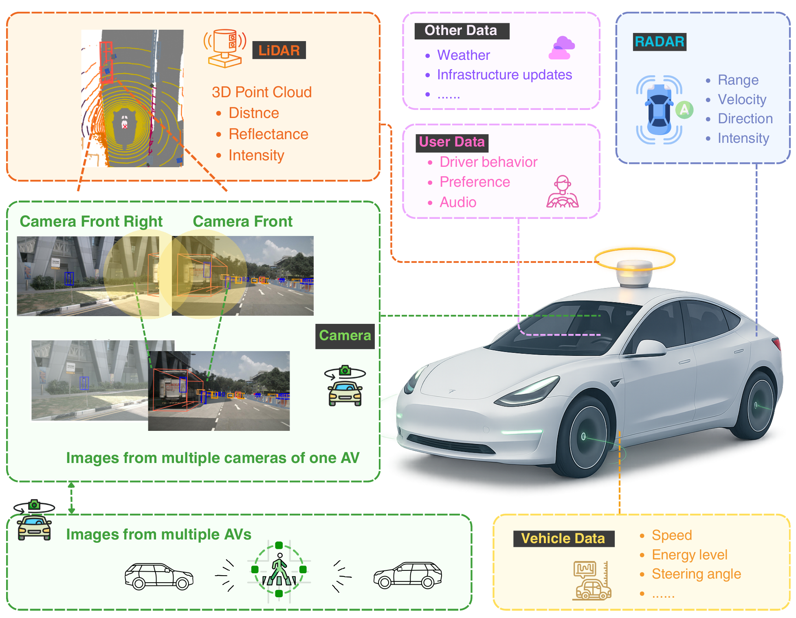
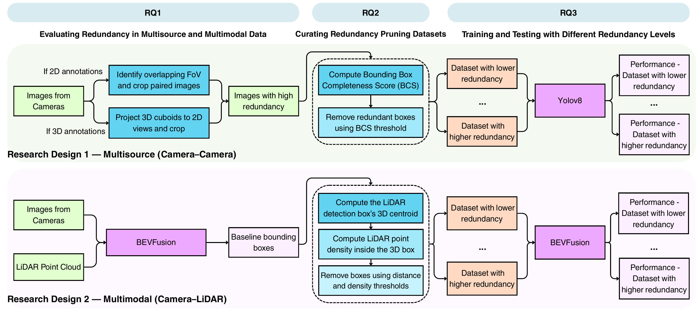

## Paper Introduction

### Background

Next-generation autonomous vehicles (AVs) rely on large volumes of multisource and multimodal M² data to support real-time decision-making. In practice, data quality (DQ) varies across sources and modalities due to environmental conditions and sensor limitations, yet AV research has largely prioritized algorithm design over DQ analysis. This work focuses on redundancy as a fundamental but underexplored DQ issue in AV datasets.

---

### Methods

We model and measure redundancy in multisource camera data and multimodal image–LiDAR data using the nuScenes and Argoverse 2 (AV2) datasets. For multisource camera redundancy, we study overlapping camera fields of view and use the Bounding Box Completeness Score (BCS) to compare the completeness of boxes at image boundaries. BCS does not measure occlusion or general visibility. For camera–LiDAR redundancy, we first evaluate the original distance-only pruning rule and then extend it to a conjunctive distance–density criterion that combines object distance with LiDAR support density. The multisource experiments train and evaluate YOLOv8 on BCS-pruned camera datasets, while the distance–density multimodal experiments remove selected current-keyframe LiDAR returns at inference from the input of a fixed pretrained BEVFusion model. Camera–LiDAR overlap can coexist with complementary information; distance and LiDAR support density are operational criteria for selecting removal candidates, rather than proof that the selected information is strictly redundant.

---

### Results

In the revised nuScenes camera–camera analysis, three training seeds at the selected BCS thresholds give mean paired mAP50 changes of +0.039, +0.028, and +0.018 for Pairs 1–3, and changes within ±0.001 for Pairs 4–6. These results are conditional on the fixed train/validation split and thresholds selected from the initial validation sweep; they measure variation across training seeds, not across different splits.

In the eight-log AV2 experiment, pruning removes 4.1–8.6% of camera-level **training labels**, with mAP50 reductions of 0.010–0.036 from the 0.640 baseline. At `tau_BCS = 0.5`, it removes 7,493 of 149,186 training labels (5.0%), while mAP50 changes from 0.640 to 0.622 on the fixed, unpruned validation split.

For camera–LiDAR pruning, the revised controlled BEVFusion evaluation uses a 25-scene, 995-keyframe nuScenes holdout, a fixed inference seed, and one common saved full-sensor baseline prediction set. At `T_dist = 30 m`, full distance-only pruning has a lost-ratio of 0.097, versus 0.052 and 0.031 for p80 and p90. The p90 gate selects 4,311 of 74,464 eligible boxes (5.8%) and removes 500,991 of 34,548,128 current-keyframe LiDAR points (1.45%), counting overlapping removals once.

The comparison depends on the matched quantity and metric. At the same distance threshold, density gating selects fewer boxes and has a lower lost-ratio. At **matched selected-box counts**, distance-only has a lower lost-ratio in all 20 comparisons, higher native nuScenes mAP in 19 of 20, and higher mAP50 in 17 of 20. The supporting p90 comparison at **approximately matched deduplicated-point counts** gives the same lost-ratio ordering, favouring distance-only. Selected-box count and removed-point volume are different budgets. Support density characterizes LiDAR support per projected image area and restricts the candidate set; these results do not establish better preservation of baseline true positives by density gating at matched selected-box counts. The full-sensor baseline remains the strongest reference on mAP50.

These experiments quantify reductions in training annotations and current-keyframe LiDAR input volume, together with the detection-performance changes. They do not demonstrate runtime, training-time, memory, energy, or storage savings.

The aggregate BEVFusion results and regeneration scripts are in [`revised_controlled_analysis/`](Multimodal/distance_density_extension/revised_controlled_analysis/). The earlier holdout results, including lost-ratios of 0.104, 0.065, and 0.050 for distance-only, p80, and p90 at 30 m, remain in the parent package as **submission-era results retained for provenance**. They are a separate evaluation family and should not be combined with the revised controlled values.

---

### Conclusion / Implications

This study shows that redundancy is a measurable and actionable DQ factor in autonomous driving datasets. By evaluating redundancy from a data-centric perspective, the work shows how selective redundancy removal changes training-annotation or LiDAR-input volume and downstream perception performance across multisource camera data and multimodal camera–LiDAR data.

---

## Research Design

The study evaluates redundancy in two settings:

- **Multisource camera redundancy:** overlapping camera views may contain duplicated observations of the same physical object. BCS-guided pruning favours boxes with greater completeness at the image boundary.
- **Multimodal camera–LiDAR redundancy:** camera and LiDAR may observe the same object while retaining complementary information. Object distance and LiDAR support density guide candidate selection, and detection-performance changes quantify the effect of removing selected LiDAR returns.

### Multisource and multimodal AV data

The following illustration summarizes the multisource and multimodal data streams considered in this study, including camera, LiDAR, RADAR, vehicle data, user data, and external data sources.

<p align="center">
  
</p>

---

## Research Questions

- **RQ1:** How to define and model redundancy in multisource and multimodal AV data for object detection?
- **RQ2:** How can redundancy be quantified, and what observable criteria can guide the selection of candidate observations for removal?
- **RQ3:** How does redundancy removal affect object detection performance across datasets, sensing modalities, and detection models?

### Workflow

The workflow below shows how the three research questions map to the two experimental branches: multisource camera redundancy and multimodal camera–LiDAR redundancy.

<p align="center">
  
</p>

## Repository Structure

This repository contains code examples and aggregate reproducibility materials accompanying the RedundancyAD journal version. The original RedundancyAD components are kept in their existing locations, and the journal-extension camera–LiDAR distance–density package is added as a separate module.

```text
RedundancyAD/
├── readme.md
├── figures/
│   ├── intro.png
│   └── workflow.png
├── Multisource_Images/
│   └── nuScenes/
│       └── camera-camera redundancy experiments
└── Multimodal/
    ├── nuScenes/
    │   └── original camera–LiDAR distance-only baseline
    └── distance_density_extension/
        ├── journal-version camera–LiDAR distance–density package
        └── revised_controlled_analysis/
            └── aggregate results and regeneration scripts for the revised manuscript
```

## Reproducibility Materials

**For the revised BEVFusion results, start with the [controlled-analysis quick start](Multimodal/distance_density_extension/revised_controlled_analysis/README.md#quick-start).**

The journal-extension camera–LiDAR distance–density package is located at:

* [`Multimodal/distance_density_extension/`](Multimodal/distance_density_extension/)

This package complements the earlier camera–LiDAR distance-only setup in `Multimodal/nuScenes/`. It contains the aggregate result files, regeneration scripts, output figures/tables, and reference provenance code for the distance–density analysis introduced in the journal version. Its top-level `data/`, `outputs/` and `scripts/` hold the submission-era matched-distance results, retained unchanged for provenance.

The aggregate reproducibility materials for the **revised** journal manuscript are in:

* [`Multimodal/distance_density_extension/revised_controlled_analysis/`](Multimodal/distance_density_extension/revised_controlled_analysis/)

Those materials come from the controlled re-evaluation, in which the full-sensor baseline and every pruning condition share one saved baseline and a fixed inference seed. They cover three distinct comparisons that must not be conflated: matched outer distance thresholds, matched selected-box counts, and approximately matched deduplicated LiDAR-point counts. The submission-era and revised controlled results are retained as separate evaluation families and should not be combined. The revised manuscript uses the common-baseline controlled values distributed in `revised_controlled_analysis/`.

The current public coverage is:

| Component | Available materials and reproduction scope |
| --- | --- |
| Revised BEVFusion analysis | Aggregate data, metric definitions, and scripts to regenerate the supplied matched-distance, matched selected-box-count, approximately matched point-budget, and class-wise outputs. The detailed exports provide the data underlying manuscript Tables VII and VIII; see the [results map](Multimodal/distance_density_extension/revised_controlled_analysis/README.md#results-map). |
| Original camera–LiDAR analysis | Original code and reference pipeline scripts, diagnostic aggregates, and submission-era holdout outputs, clearly separated from the revised controlled results. |
| nuScenes camera–camera analysis | A [Pair 2 example notebook and method guide](Multisource_Images/nuScenes/). Per-seed result files and the revised visibility-analysis outputs are not included. |
| AV2 camera–camera analysis | Results are summarized above from the revised manuscript. The AV2 training/evaluation code and aggregate result files are not included in this repository. |

Raw datasets, pretrained checkpoints, and full inference artifacts are not redistributed here. Regenerating the supplied aggregate figures and tables does not require model inference; rerunning the experiments requires additional data, models, and pipeline components described in the [reproduction notes](Multimodal/distance_density_extension/docs/reproduction_notes.md).
